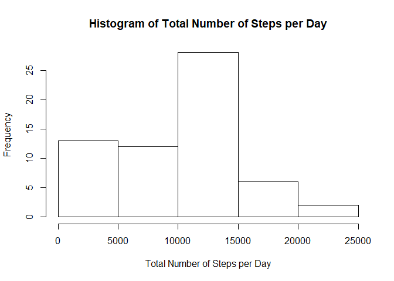
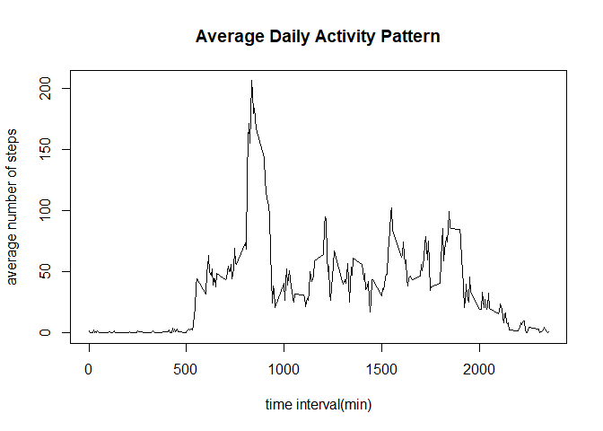
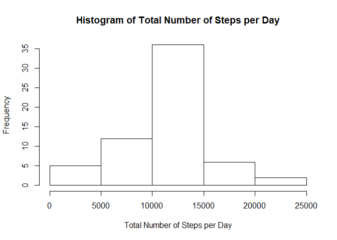
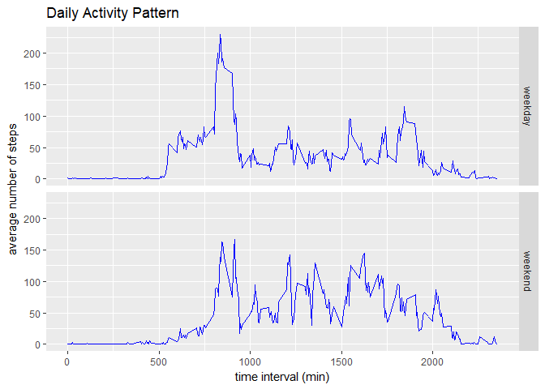

## Loading and preprocessing the data

```r
data=read.csv("activity.csv");
data$date<-as.Date(data$date,"%Y-%m-%d")
```

## What is mean total number of steps taken per day?
Total number of steps taken per day can be calculated using the following code

```r
totalStep<-with(data,tapply(steps,date,sum,na.rm=TRUE))
```
Histogram of the total number of steps taken each day is summarized below

```r
hist(totalStep,main='Histogram of Total Number of Steps per Day', xlab='Total Number of Steps per Day')
```

<!-- -->

Calculating mean and median of the total number of steps per day

```r
meanStep=mean(totalStep)
medianStep=median(totalStep)
```
The mean total number of steps is 9354, and the median total number of steps is 10395.


## What is the average daily activity pattern?
Daily activity pattern can be visualized with the following time series plot.

```r
dailyStep<-with(data,tapply(steps,interval,mean,na.rm=TRUE))
plot(as.numeric(dimnames(dailyStep)[[1]]),dailyStep,type='l',xlab='time interval(min)',ylab='average number of steps',main='Average Daily Activity Pattern')
```

<!-- -->

```r
names(which.max(dailyStep))
```

```
## [1] "835"
```
The 104th 5-minute interval, which corresponds to the 835-minute interval, contains the maximum average number of steps at 206 steps.


## Imputing missing values

```r
sum(is.na(data$steps))
```

```
## [1] 2304
```
There are a total of 2304 step data missing in the data set.

To fill in the missing value, we can use the rounded mean for the missing 5-minute interval across all days to fill in the missing value and create a new dataset with the following code.


```r
data1<-data
for (i in 1:nrow(data1)){
    if (is.na(data1[i,1])){
        data1[i,1]<-round(dailyStep[as.character(data1[i,3])])
    }
}
```

Total number of steps taken per day with the imputed dataset can be calculated using the following code

```r
totalStep1<-with(data1,tapply(steps,date,sum))
```
Histogram of the total number of steps taken each day in the new dataset is summarized below

```r
hist(totalStep1,main='Histogram of Total Number of Steps per Day', xlab='Total Number of Steps per Day')
```

<!-- -->

The mean and median of the total number of steps per day in the new dataset is calculated with

```r
meanStep1=mean(totalStep1)
medianStep1=median(totalStep1)
options(scipen=10)
```

The mean total number of steps is 10766, and the median total number of steps is 10762. These values differ from the estimates from the first part of the assignment. Both the mean and median of the total number of steps per day is increased in the new dataset with the missing value imputed. The mean espcially increased a lot in the new dataset, making the mean and median much closer to each other in the new dataset. As can be seen from comparing the two histograms, replacing missing value with the mean of 5 minutes interval has decreased the frequency of days with lower total number of steps per day, the bin with 0-5000 steps per day has a much smaller frequency in the new dataset then the old dataset. This is caused by the inclusion of the missing data points in the new dataset which inflates the total number of steps per day for all data points. 

## Are there differences in activity patterns between weekdays and weekends?
We first create a new variable called 'week' in the dataset that indicates whether a given date is a weekday or weekend. 

```r
library(dplyr)
```

```
## 
## Attaching package: 'dplyr'
```

```
## The following objects are masked from 'package:stats':
## 
##     filter, lag
```

```
## The following objects are masked from 'package:base':
## 
##     intersect, setdiff, setequal, union
```

```r
data2<-mutate(data1,week = ifelse(weekdays(date) %in% c("Saturday","Sunday"),"weekend","weekday"))
data2$week<-as.factor(data2$week)
```
We can then make a time series plot that shows the daily activity pattern of the average number of steps taken averaged across all weekdays or weekend days.

```r
library(ggplot2)
g<-ggplot(data2,aes(interval,steps))
g+geom_line(stat="summary",fun.y="mean",color="blue")+facet_grid(week~.)+labs(x='time interval (min)',y='average number of steps',title='Daily Activity Pattern')
```

<!-- -->

From the time series plot, we can compare the difference between weekdays and weekend days activity pattern and generally speaking, people take fewer steps on weekend than weekdays and the peak at around 900 mins is less pronounced in weekend than weekdays.
